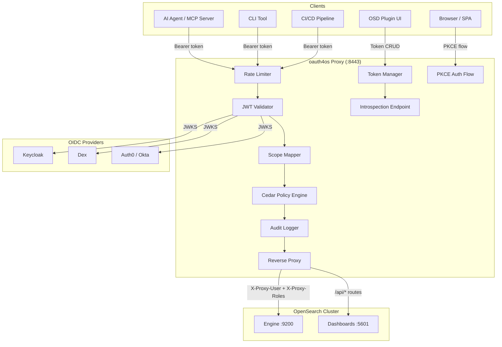
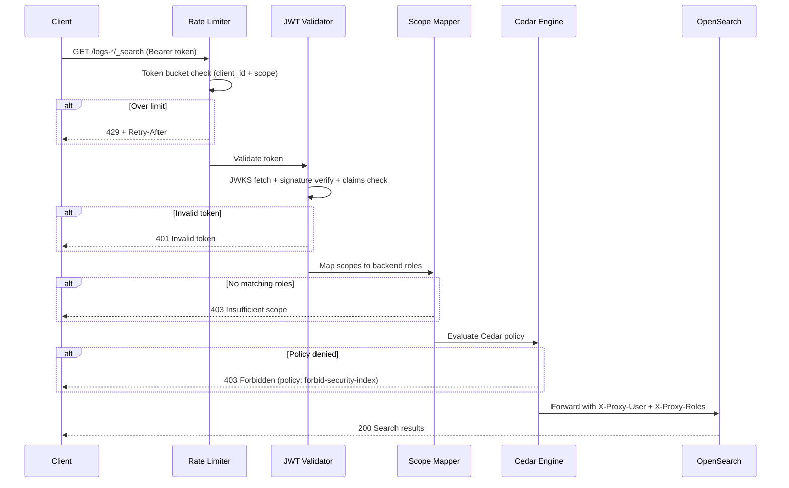
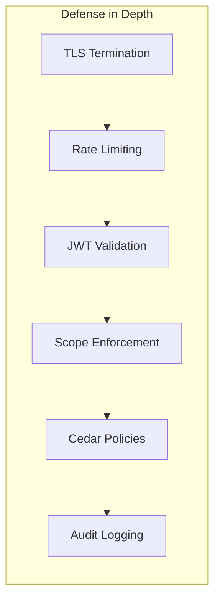
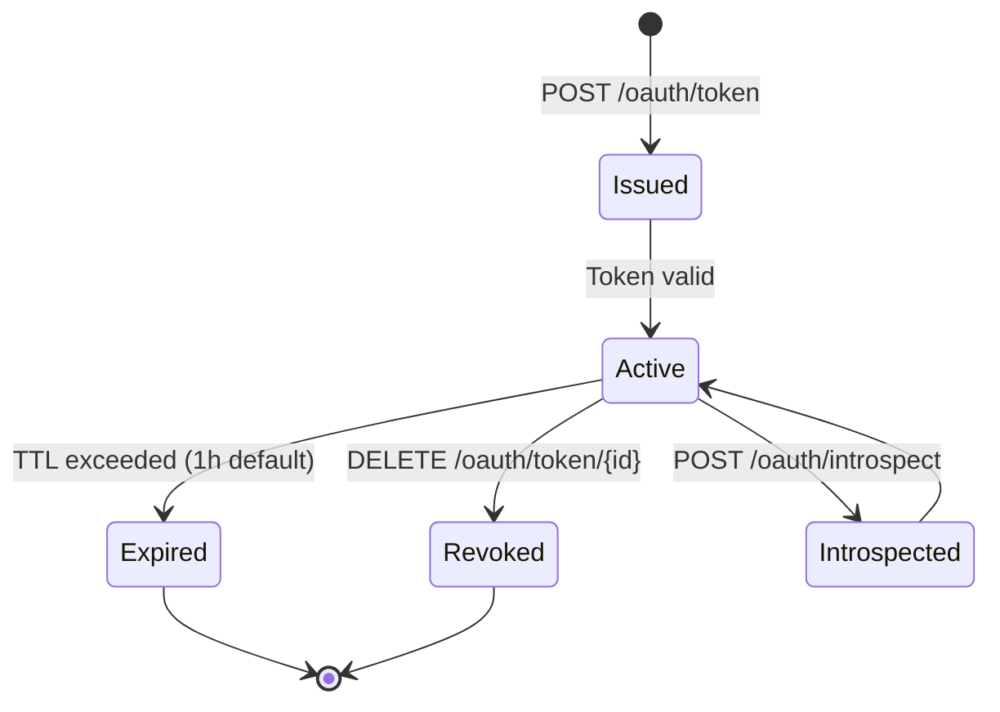
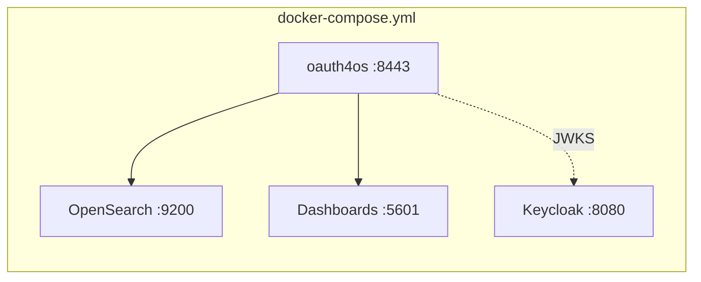
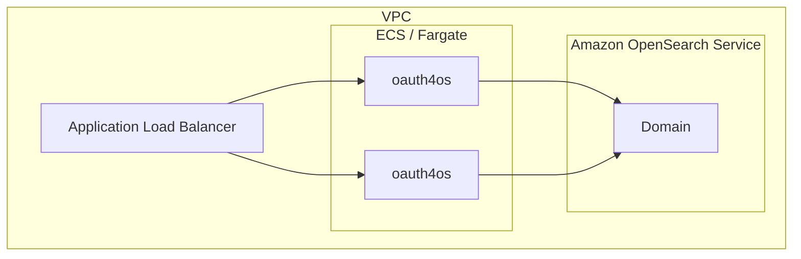

# Architecture

oauth4os is a reverse proxy that adds OAuth 2.0 token management, JWT validation, scope-to-role mapping, and Cedar policy evaluation in front of OpenSearch. It requires zero changes to OpenSearch itself.

## System Overview



## Request Flow

Every proxied request passes through 5 stages in order:



## Components

### Reverse Proxy (`cmd/proxy/main.go`)

The main binary. Loads config, initializes all components, and runs the HTTP server with graceful shutdown.

- Connection-pooled `http.Transport` (100 idle conns, 50 per host)
- Routes `/api/*` to Dashboards, everything else to Engine
- Prometheus metrics at `/metrics`
- Health check at `/health`
- Read/write/idle timeouts configured
- Graceful shutdown on SIGINT/SIGTERM (30s drain)

### JWT Validator (`internal/jwt/`)

Validates Bearer tokens against OIDC provider JWKS endpoints.

- JWKS auto-discovery from provider issuer URL
- RS256 and ES256 signature verification
- Claims validation: `exp`, `iss`, `aud`
- JWKS key cache with background refresh
- Multi-provider support (Keycloak, Dex, Auth0, Okta)

### Scope Mapper (`internal/scope/`)

Maps OAuth scopes to OpenSearch security roles.

- Global scope mapping (all providers)
- Per-tenant mapping with global fallback
- Scope format: `read:logs-*`, `write:dashboards`, `admin`
- Maps to `backend_user` + `backend_roles` for OpenSearch Security Plugin

### Cedar Policy Engine (`internal/cedar/`)

Fine-grained authorization using Cedar-style policies.

- Permit/Forbid effect with principal/action/resource matching
- Multi-tenant: per-issuer policies with global fallback
- Default policies: permit all, forbid `.opendistro_security` index
- Evaluation returns decision + reason + matching policy ID

### Token Manager (`internal/token/`)

Issues, revokes, lists, and inspects proxy-managed tokens.

| Endpoint | Method | Description |
|----------|--------|-------------|
| `/oauth/token` | POST | Issue token (client_credentials grant) |
| `/oauth/token/{id}` | DELETE | Revoke token |
| `/oauth/token/{id}` | GET | Inspect token |
| `/oauth/tokens` | GET | List active tokens |
| `/oauth/introspect` | POST | RFC 7662 introspection |

### Token Introspection (`internal/introspect/`)

RFC 7662 compliant. Returns `active: true/false` with scope, client_id, exp, iat. Used by resource servers to validate tokens without direct DB access.

### PKCE Flow (`internal/pkce/`)

RFC 7636 Proof Key for Code Exchange for browser/SPA clients.

- Authorization code flow with S256 code challenge
- Short-lived auth codes (5 min)
- Exchanges code + verifier for access token
- Prevents authorization code interception attacks

### Rate Limiter (`internal/ratelimit/`)

Per-client token bucket rate limiting.

- Scope-aware: each scope can have its own RPM limit
- Most restrictive scope wins for multi-scope tokens
- Per-client bucket isolation (no cross-client interference)
- Returns `429 Too Many Requests` + `Retry-After` header
- Token endpoint rate-limited by IP (abuse prevention)

### Audit Logger (`internal/audit/`)

Structured request logging for compliance and debugging.

- Logs: timestamp, client_id, scopes, method, path
- Writes to stdout (container-friendly, pipe to any log collector)

### Config (`internal/config/`)

YAML configuration loader.

```yaml
upstream:
  engine: http://opensearch:9200
  dashboards: http://opensearch-dashboards:5601

providers:
  - name: keycloak
    issuer: https://keycloak.example.com/realms/opensearch

scope_mapping:
  "read:logs-*":
    backend_roles: [logs_read_access]
  "admin":
    backend_roles: [all_access]

tenants:
  "https://dex.example.com":
    scope_mapping:
      "read:metrics-*":
        backend_roles: [metrics_reader]

rate_limits:
  "read:logs-*": 600
  "admin": 60
```

## Security Model



1. **TLS** — Optional TLS termination at the proxy (or behind a load balancer)
2. **Rate limiting** — Token bucket per client prevents abuse
3. **JWT validation** — Cryptographic signature verification via JWKS
4. **Scope enforcement** — Only mapped scopes get backend roles
5. **Cedar policies** — Fine-grained deny rules (e.g., block security index access)
6. **Audit logging** — Every authenticated request logged with client identity

### Token Lifecycle



### Scope Isolation

Scopes control what indices and operations a client can access:

| Scope | Allowed | Blocked |
|-------|---------|---------|
| `read:logs-*` | GET/POST on `logs-*` indices | Write operations, other indices |
| `write:logs-*` | All operations on `logs-*` | Other indices |
| `admin` | All operations, all indices | `.opendistro_security` (Cedar deny) |

## Deployment Topology

### Docker Compose (Development)



### AWS (Production)



Deployed via CDK (`deploy/cdk/`):
- ECS Fargate service behind ALB
- Amazon OpenSearch Service managed domain
- Secrets Manager for OIDC client credentials
- CloudWatch for logs and metrics

### Helm (Kubernetes)

```
helm install oauth4os deploy/helm/oauth4os \
  --set upstream.engine=https://opensearch:9200 \
  --set providers[0].issuer=https://keycloak/realms/os
```

## Integration Points

### MCP Server (`examples/mcp-server/`)

Reference AI agent integration. Python MCP server with 7 tools:

- `search_logs`, `aggregate`, `get_indices`, `get_mappings` (read)
- `create_index`, `delete_docs` (write)
- `get_cluster_health` (admin)

Authenticates via client_credentials, auto-refreshes tokens.

### OSD Plugin (`plugins/oauth4os-dashboards/`)

OpenSearch Dashboards plugin for token management UI:
- List active tokens
- Create scoped tokens
- Revoke tokens
- View token details

### CLI (`cmd/cli/`)

Command-line tool for token management:
- `oauth4os login` — OIDC login flow
- `oauth4os create-token` — Issue scoped token
- `oauth4os revoke-token` — Revoke token
- `oauth4os status` — Show current auth state
- Config file: `~/.oauth4os.yaml`
- Token caching with auto-refresh

## Metrics

Prometheus metrics exposed at `GET /metrics`:

| Metric | Type | Description |
|--------|------|-------------|
| `oauth4os_requests_total` | counter | Total proxied requests |
| `oauth4os_requests_active` | gauge | Currently in-flight requests |
| `oauth4os_requests_failed` | counter | Failed requests (auth + policy) |
| `oauth4os_auth_success` | counter | Successful JWT validations |
| `oauth4os_auth_failed` | counter | Failed JWT validations |
| `oauth4os_cedar_denied` | counter | Cedar policy denials |
| `oauth4os_rate_limited` | counter | Rate-limited requests (429s) |
| `oauth4os_upstream_errors` | counter | Upstream connection failures |
| `oauth4os_uptime_seconds` | gauge | Proxy uptime |

## Directory Structure

```
cmd/
  proxy/              Main proxy binary
  cli/                CLI tool
internal/
  jwt/                JWT validation + JWKS cache
  scope/              Scope-to-role mapping (multi-tenant)
  cedar/              Cedar policy engine (multi-tenant)
  token/              Token lifecycle (issue/revoke/list/introspect)
  introspect/         RFC 7662 token introspection
  pkce/               RFC 7636 PKCE for browser clients
  ratelimit/          Per-client token bucket rate limiting
  config/             YAML config loader
  audit/              Structured request audit logging
plugins/
  oauth4os-dashboards/  OSD plugin for token management UI
examples/
  mcp-server/         Reference MCP server for AI agents
deploy/
  cdk/                AWS CDK stack
  helm/               Kubernetes Helm chart
  keycloak/           Keycloak realm config for testing
test/
  integration/        Scope enforcement, Cedar, proxy tests
  e2e/                Full docker-compose end-to-end tests
bench/                Go benchmarks (JWT, scope, Cedar, proxy)
```
