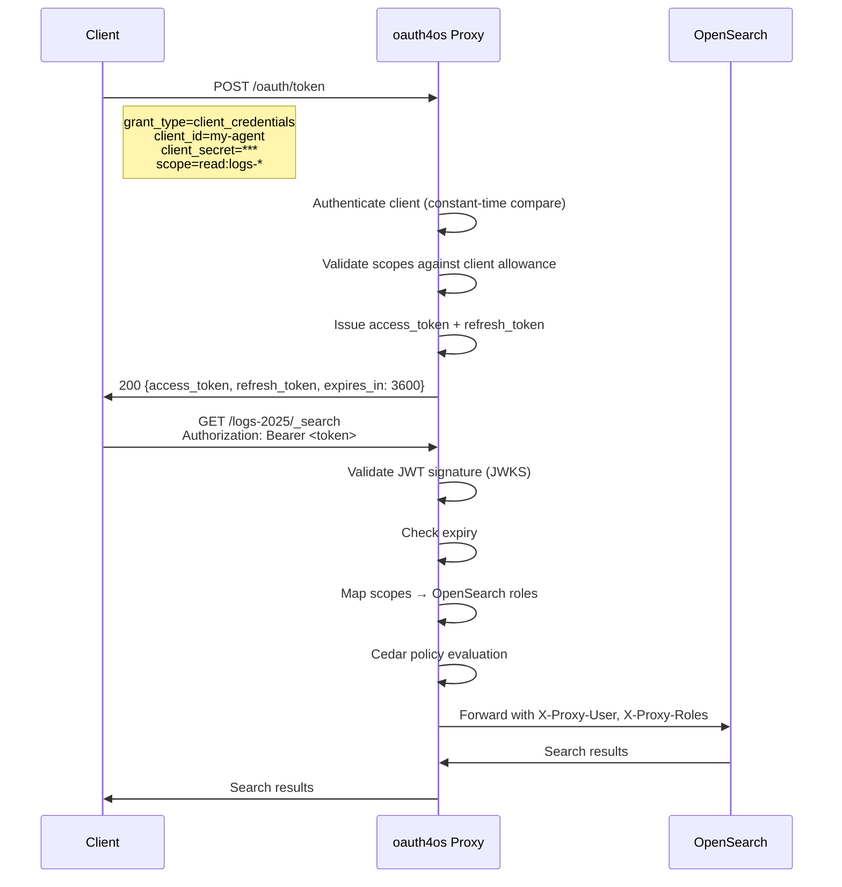
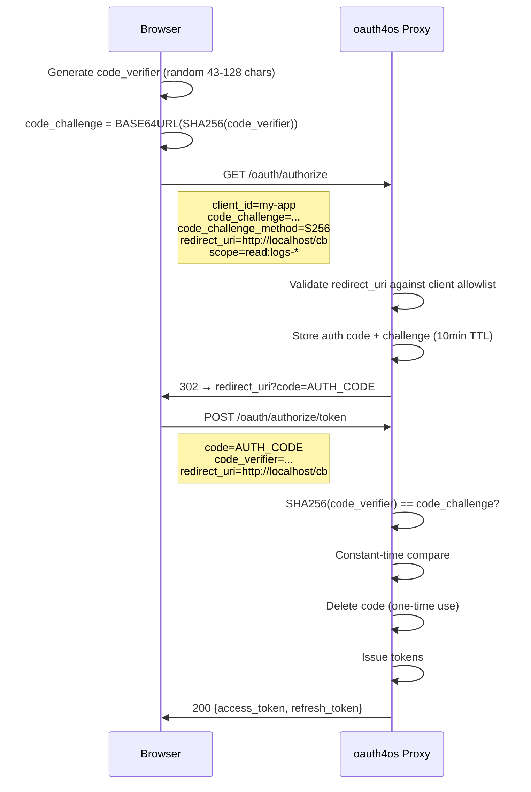
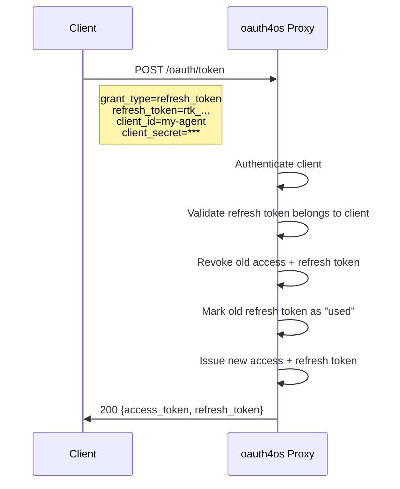
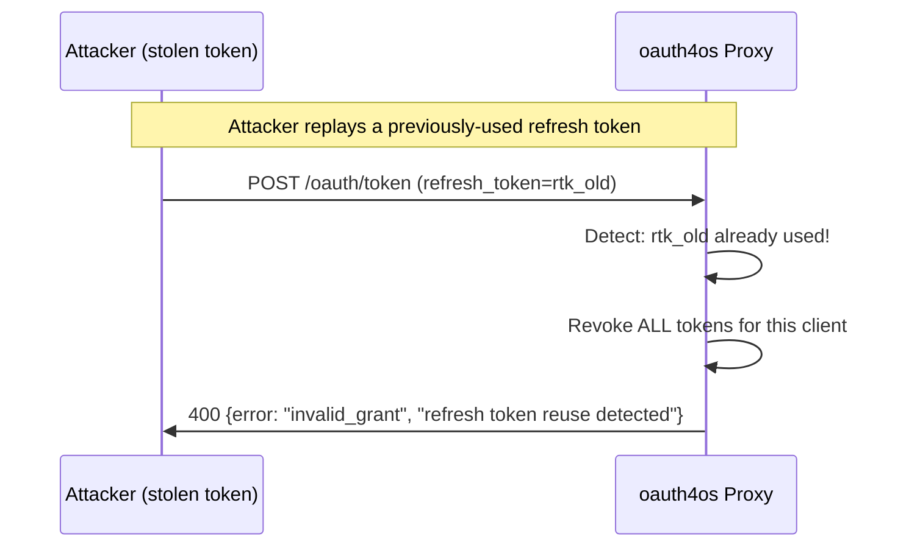
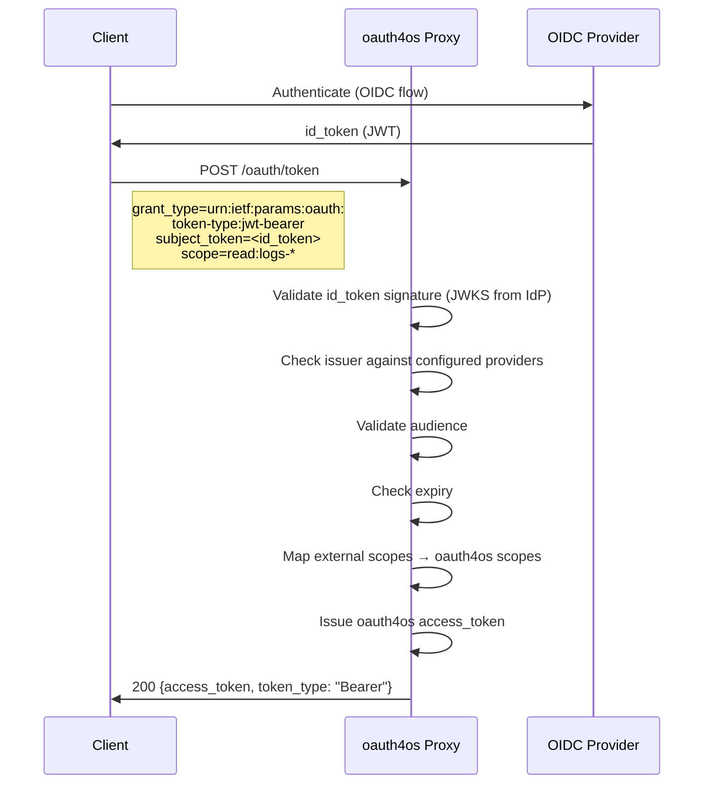
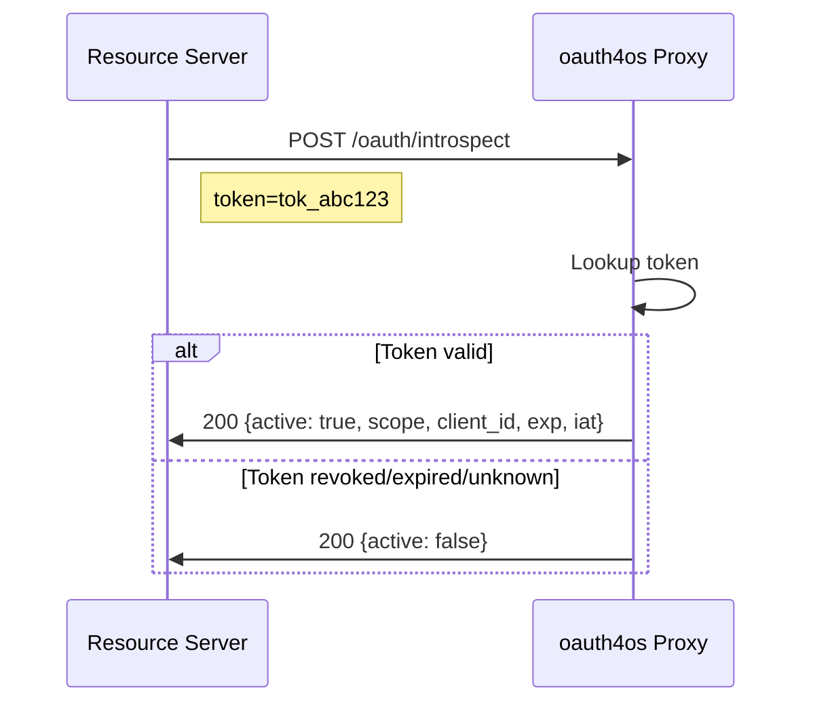
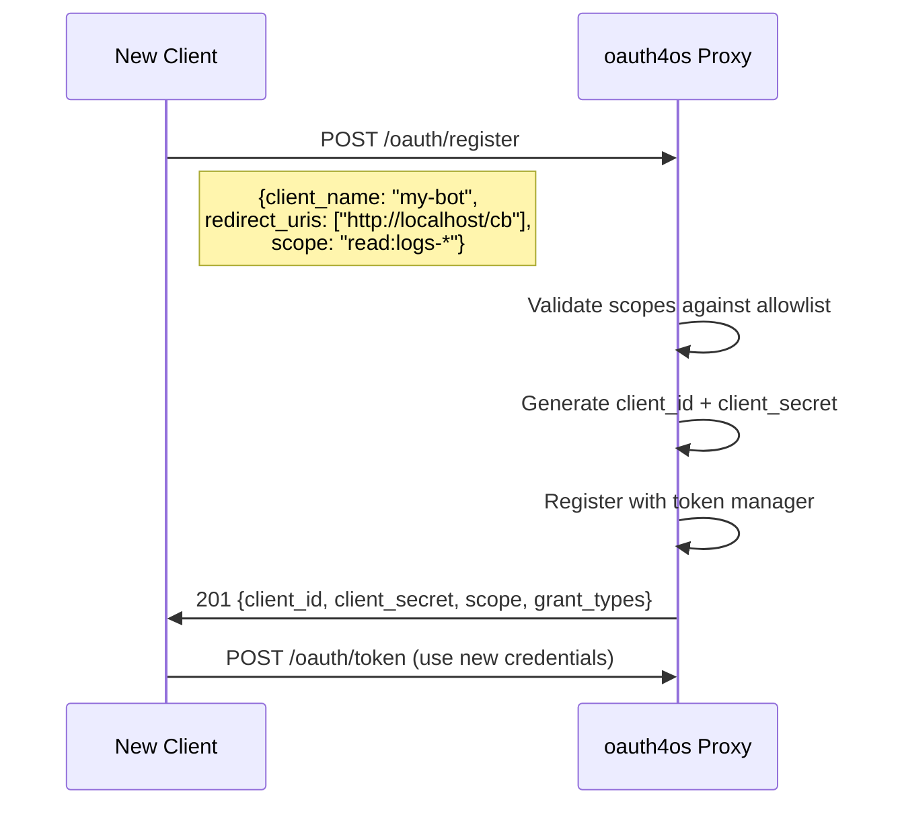
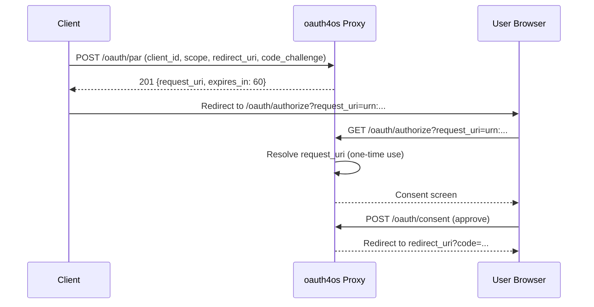
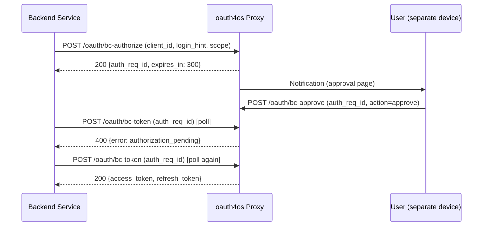

# OAuth Flows — oauth4os

All supported OAuth 2.0 flows with sequence diagrams.

## 1. Client Credentials (RFC 6749 §4.4)

Machine-to-machine authentication. The primary flow for AI agents, CI/CD pipelines, and backend services.



**Config:**
```yaml
# Clients registered via POST /oauth/register or config
scope_mapping:
  "read:logs-*":
    backend_user: agent-logs-reader
    backend_roles: [logs_read_access]
```

**curl:**
```bash
# Get token
TOKEN=$(curl -s -X POST http://localhost:8443/oauth/token \
  -d "grant_type=client_credentials" \
  -d "client_id=my-agent" \
  -d "client_secret=secret" \
  -d "scope=read:logs-*" | jq -r .access_token)

# Query
curl -H "Authorization: Bearer $TOKEN" \
  http://localhost:8443/logs-*/_search \
  -d '{"query":{"match":{"level":"error"}}}'
```

## 2. PKCE Authorization Code (RFC 7636)

Browser-based authentication. Prevents authorization code interception without requiring a client secret.



**Security controls:**
- S256 only (plain not supported)
- Constant-time PKCE verification (`crypto/subtle`)
- One-time authorization codes
- 10-minute code expiry
- redirect_uri must match client's registered allowlist (prevents open redirect)

## 3. Token Refresh (RFC 6749 §6)

Rotate tokens without re-authentication. Includes reuse detection.



**Reuse detection:**


If a refresh token is used twice, it indicates theft. The entire token family for that client is revoked immediately.

## 4. Token Exchange (RFC 8693)

Exchange an external OIDC token for an oauth4os token. Enables federation with Keycloak, Auth0, Okta, etc.



**Config:**
```yaml
providers:
  - name: keycloak
    issuer: https://keycloak.example.com/realms/opensearch
    audience: ["oauth4os"]
    jwks_uri: auto  # OIDC auto-discovery
```

## 5. Token Introspection (RFC 7662)

Resource servers or admin tools query token validity.



**Response (active):**
```json
{
  "active": true,
  "scope": "read:logs-* write:dashboards",
  "client_id": "my-agent",
  "sub": "my-agent",
  "exp": 1712890800,
  "iat": 1712887200,
  "token_type": "Bearer"
}
```

No token details are leaked for inactive tokens — only `{"active": false}`.

## 6. Dynamic Client Registration (RFC 7591)

Clients self-register via API. Scope allowlist prevents privilege escalation.



**Retrieve client (secret hidden):**
```bash
curl http://localhost:8443/oauth/register/client_abc123
# Returns metadata without client_secret
```

## 7. Device Authorization (RFC 8628)

For CLI tools and IoT devices without a browser. User authorizes on a separate device.

```
CLI Device                  oauth4os                    User's Browser
    │                          │                             │
    │  POST /oauth/device/code │                             │
    │  client_id=cli-tool      │                             │
    │ ────────────────────────▶│                             │
    │                          │                             │
    │  {device_code, user_code,│                             │
    │   verification_uri,      │                             │
    │   interval: 5}           │                             │
    │◀─────────────────────────│                             │
    │                          │                             │
    │  Display to user:        │                             │
    │  "Go to /oauth/device    │                             │
    │   Enter code: ABCD-1234" │                             │
    │                          │     GET /oauth/device       │
    │                          │◀────────────────────────────│
    │                          │     Enter code + approve    │
    │                          │◀────────────────────────────│
    │                          │                             │
    │  POST /oauth/device/token│                             │
    │  (poll every 5s)         │                             │
    │ ────────────────────────▶│                             │
    │                          │  Before approve:            │
    │  {error:                 │  authorization_pending      │
    │   authorization_pending} │                             │
    │◀─────────────────────────│                             │
    │                          │  After approve:             │
    │  POST /oauth/device/token│                             │
    │ ────────────────────────▶│                             │
    │  {access_token, ...}     │                             │
    │◀─────────────────────────│                             │
```

```bash
# Request device code
curl -X POST https://proxy:8443/oauth/device/code \
  -d "client_id=cli-tool&scope=read:logs-*"

# Poll for token (repeat until success)
curl -X POST https://proxy:8443/oauth/device/token \
  -d "grant_type=urn:ietf:params:oauth:grant-type:device_code&device_code=<code>"
```

## 8. API Key Authentication

Stateless authentication via `X-API-Key` header. No OAuth flow — keys are pre-provisioned.

```
Client                      oauth4os                    OpenSearch
    │                          │                             │
    │  GET /logs/_search       │                             │
    │  X-API-Key: osk_abc123   │                             │
    │ ────────────────────────▶│                             │
    │                          │  Validate key prefix + hash │
    │                          │  Check rate limit (per key) │
    │                          │  Map key scopes → roles     │
    │                          │  Cedar evaluation           │
    │                          │                             │
    │                          │  Forward with roles         │
    │                          │ ────────────────────────────▶│
    │  200 {hits: [...]}       │                             │
    │◀─────────────────────────│◀────────────────────────────│
```

```bash
# Create an API key
curl -X POST https://proxy:8443/admin/apikeys \
  -H "Content-Type: application/json" \
  -d '{"client_id":"my-agent","name":"ci-key","scopes":["read:logs-*"]}'

# Use it
curl -H "X-API-Key: osk_abc123..." \
  https://proxy:8443/logs-demo/_search
```

## 9. Pushed Authorization Requests (RFC 9126)

Client pushes auth params server-side before redirecting the user — prevents parameter tampering.



## 10. Client Initiated Backchannel Authentication (CIBA)

Backend services authenticate users without browser redirects — user approves on a separate device.



## Flow Selection Guide

| Use Case | Flow | Why |
|---|---|---|
| AI agent / bot | Client Credentials | No user interaction needed |
| CI/CD pipeline | Client Credentials or API Key | Automated, scoped access |
| Browser SPA | PKCE | No client secret in browser |
| CLI tool (interactive) | PKCE or Device Flow | Interactive login, secure |
| CLI tool (headless) | Device Flow | No local browser needed |
| IoT device | Device Flow | Authorize on separate device |
| External IdP federation | Token Exchange | Reuse existing OIDC tokens |
| Long-running service | Client Credentials + Refresh | Auto-rotate without re-auth |
| Admin monitoring | Introspection | Check token validity |
| Self-service onboarding | Registration | Automated client provisioning |
| Simple scripts | API Key | No OAuth flow, pre-provisioned |

## Security Summary

| Flow | Key Protection |
|---|---|
| Client Credentials | Constant-time secret compare |
| PKCE | S256 challenge, redirect_uri allowlist, one-time codes |
| Refresh | Token rotation, reuse detection, family revocation |
| Token Exchange | JWKS signature verification, issuer/audience validation |
| Introspection | No details leaked for inactive tokens |
| Registration | Scope allowlist, redirect_uri binding |
| Device Flow | Short-lived user codes, 10-min expiry, one-time use |
| API Key | Hashed storage, prefix-based lookup, per-key rate limits |
| PAR | Server-side param storage, one-time URI, 60s expiry |
| CIBA | Backchannel auth, 5-min expiry, one-time token issuance |
