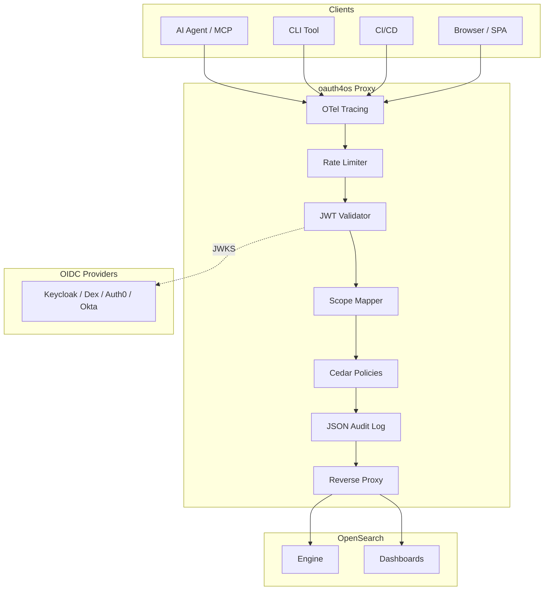

# RFC Response — OAuth 2.0 Proxy for OpenSearch

> Draft comment for [opensearch-project/.github#491](https://github.com/opensearch-project/.github/issues/491)

---

## Comment

Hi all — we built a working proof-of-concept for the OAuth 2.0 proxy approach described in this RFC.

**Repo**: [github.com/seraphjiang/oauth4os](https://github.com/seraphjiang/oauth4os)
**Demo**: [oauth4os.huanji.profile.aws.dev](http://oauth4os.huanji.profile.aws.dev/)
**License**: Apache 2.0

### What it does

oauth4os is a reverse proxy that sits in front of OpenSearch Engine and Dashboards, adding OAuth 2.0 token management with zero changes to OpenSearch itself.

```
Clients → oauth4os (:8443) → OpenSearch Engine (:9200)
                            → OpenSearch Dashboards (:5601)
```

### Architecture



### Features implemented

| Category | Feature | Status |
|----------|---------|--------|
| **Core** | Reverse proxy (Engine + Dashboards) | ✅ |
| **Core** | Connection pooling, graceful shutdown, request timeouts | ✅ |
| **Auth** | JWT validation (RS256/ES256) with JWKS auto-discovery | ✅ |
| **Auth** | Multi-provider OIDC support (Keycloak, Dex, Auth0, Okta) | ✅ |
| **Auth** | PKCE authorization code flow for browser clients (RFC 7636) | ✅ |
| **Auth** | Token introspection (RFC 7662) | ✅ |
| **Auth** | Token exchange — swap external IdP tokens for scoped tokens (RFC 8693) | ✅ |
| **Auth** | Refresh token rotation with reuse detection | ✅ |
| **Auth** | Dynamic client registration (RFC 7591) | ✅ |
| **Auth** | OIDC Discovery endpoint (/.well-known/openid-configuration) | ✅ |
| **Auth** | Audience validation per provider | ✅ |
| **Authz** | Scope-to-role mapping (per-tenant with global fallback) | ✅ |
| **Authz** | Cedar policy engine (permit/forbid, multi-tenant) | ✅ |
| **Authz** | Per-client rate limiting (token bucket, scope-aware) | ✅ |
| **Ops** | Prometheus metrics endpoint (/metrics) | ✅ |
| **Ops** | OpenTelemetry-style tracing (X-Trace-ID, span per stage) | ✅ |
| **Ops** | Structured JSON audit logging | ✅ |
| **Ops** | Prometheus alerting rules (pre-built) | ✅ |
| **Ops** | X-Request-ID propagation | ✅ |
| **Admin** | REST API for scope mappings, Cedar policies, providers, rate limits | ✅ |
| **Multi-tenant** | Per-OIDC-provider scope mapping and Cedar policies | ✅ |
| **Token** | Issue, revoke, list, inspect tokens via REST | ✅ |
| **CLI** | `oauth4os login`, `create-token`, `revoke-token`, `status` | ✅ |
| **CLI** | Config file (~/.oauth4os.yaml), token caching, auto-refresh | ✅ |
| **CLI** | Shell completions (bash/zsh/fish), --output json\|table\|yaml | ✅ |
| **Plugin** | OpenSearch Dashboards plugin for token management UI | ✅ |
| **Integration** | MCP server example (7 tools for AI agents) | ✅ |
| **Deploy** | Docker + docker-compose | ✅ |
| **Deploy** | Helm chart | ✅ |
| **Deploy** | AWS CDK stack | ✅ |
| **Deploy** | GitHub Actions CI + Goreleaser (multi-platform binaries) | ✅ |

### By the numbers

| Metric | Value |
|--------|-------|
| Go source (non-test) | ~3,900 lines |
| Test code | ~4,500 lines |
| Total project | ~14,700 lines |
| Test functions | 220+ |
| Internal packages | 13 |
| Commits | 89 |
| OAuth RFCs implemented | 4 (7636, 7662, 8693, 7591) |

### Key design decisions

1. **Zero changes to OpenSearch** — The proxy sits in front, translating OAuth scopes to OpenSearch Security Plugin backend roles via `X-Proxy-User` and `X-Proxy-Roles` headers. Existing auth methods continue to work.

2. **Cedar for fine-grained authz** — We chose Cedar-style policies over RBAC because they support deny-overrides (e.g., "permit all, but forbid `.opendistro_security` index access") and are composable per-tenant.

3. **Multi-tenant by design** — Each OIDC provider (issuer) can have its own scope mappings and Cedar policies. A Keycloak realm and a Dex instance can coexist with different authorization rules.

4. **Token exchange as the federation story** — RFC 8693 lets external IdP users exchange their JWT for a scoped oauth4os token. This is the key enabler for machine-to-machine access without sharing OpenSearch credentials.

5. **MCP server as the AI story** — The reference MCP server shows how AI agents (Claude, LangChain, etc.) can securely query OpenSearch with scoped, auditable, revocable tokens.

### How to try it

```bash
git clone https://github.com/seraphjiang/oauth4os
cd oauth4os
docker compose up
```

```bash
# Get a token
curl -X POST http://localhost:8443/oauth/token \
  -d "grant_type=client_credentials&client_id=demo&client_secret=secret&scope=read:logs-*"

# Query OpenSearch through the proxy
curl -H "Authorization: Bearer <token>" \
  http://localhost:8443/logs-*/_search \
  -d '{"query":{"match_all":{}}}'
```

### What's next

We see this as a Phase 1 proof-of-concept. Potential next steps if the community is interested:

- **Phase 2**: OSD plugin for token management UI (consent screen, token governance)
- **Phase 3**: Upstream contribution — integrate token management natively into OpenSearch Security Plugin
- **JWE support**: Encrypted JWT tokens for sensitive claims
- **Formal Cedar integration**: Use the official Cedar SDK when a Go binding is available

### Questions for the community

1. **Deployment model**: Should this be a standalone proxy (current approach), an OpenSearch plugin, or both?
2. **Scope format**: We used `read:<index-pattern>` / `write:<index-pattern>` / `admin`. Does this align with how teams think about OpenSearch access?
3. **Cedar vs. simpler RBAC**: Is Cedar's expressiveness worth the complexity, or would a simpler role-based model suffice?
4. **Token storage**: Currently in-memory. Should we add DynamoDB/Redis/OpenSearch-backed persistence?

We'd love feedback. Happy to demo or walk through the code.

---

*Built by the S3 O11y team as a proof-of-concept for the RFC. All code is Apache 2.0 licensed.*
