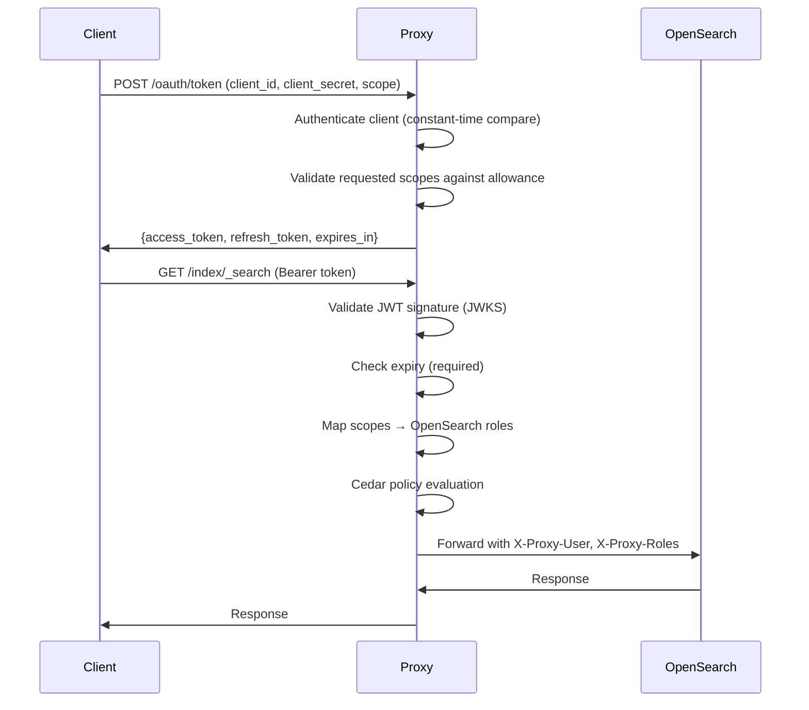
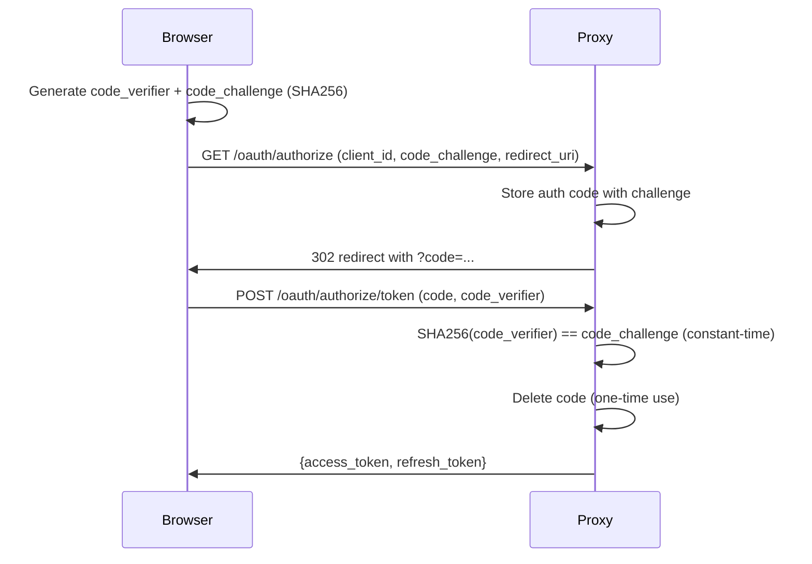
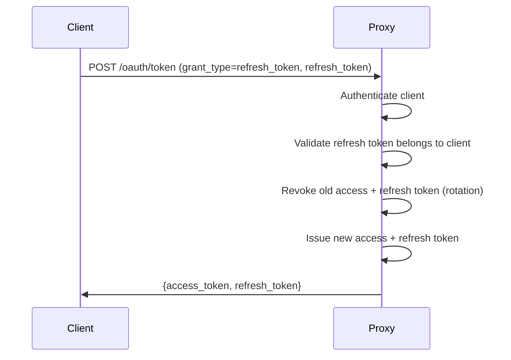

# Security Model — oauth4os

## Threat Model

### Assets
- **OpenSearch data** — indices containing logs, metrics, traces
- **OAuth tokens** — access tokens and refresh tokens
- **OIDC provider credentials** — client secrets, JWKS keys
- **Cedar policies** — access control rules
- **Proxy configuration** — upstream URLs, scope mappings

### Threat Actors
| Actor | Capability | Goal |
|---|---|---|
| External attacker | Network access to proxy | Unauthorized data access |
| Compromised client | Valid but limited token | Privilege escalation |
| Malicious IdP | Controls OIDC discovery | Token forgery, SSRF |
| Insider | Valid admin token | Access beyond scope |

### Attack Surface

```
Internet → [Proxy :8443] → [OpenSearch :9200]
              ↕                  ↕
         [OIDC Provider]    [Dashboards :5601]
```

## Authentication Flows

### Client Credentials (Machine-to-Machine)



### PKCE (Browser Clients)



### Token Refresh



## JWT Validation Steps

Every request with a Bearer token goes through this pipeline:

1. **Parse** — extract header and claims without verification
2. **Issuer lookup** — match `iss` claim to configured provider; reject unknown issuers
3. **JWKS fetch** — retrieve signing keys via OIDC auto-discovery or configured URI
   - 1-hour cache with forced refresh on key miss (handles rotation)
   - 10-second HTTP timeout on JWKS/discovery endpoints
4. **Key match** — find RSA key by `kid`; fallback to first RSA key if `kid` absent
5. **Signature verify** — RSA signature validation; reject non-RSA algorithms (prevents alg confusion)
6. **Expiry check** — `exp` claim required and validated (no grace period)
7. **Scope extraction** — supports space-delimited string and JSON array formats
8. **Client ID extraction** — from `client_id` or `azp` claim

### OIDC Auto-Discovery Security

- Discovery URL derived from issuer: `{issuer}/.well-known/openid-configuration`
- **Issuer mismatch check**: discovery document's `issuer` field must match configured issuer (prevents SSRF via redirect)
- Resolved JWKS URI cached after first discovery

## Cedar Policy Evaluation

Cedar policies are evaluated after JWT validation and scope mapping:

```
Request → JWT Validation → Scope Mapping → Cedar Evaluation → Proxy Forward
```

### Evaluation Model

- **Forbid-overrides**: any matching `forbid` policy denies the request, regardless of `permit` policies
- **Default deny**: if no `permit` policy matches, the request is denied
- **Matching**: principal (JWT sub), action (HTTP method), resource (OpenSearch index)
- **Conditions**: `when` (must be true) and `unless` (must be false) clauses

### Example Policies

```cedar
// Allow read access to logs indices for clients with read:logs scope
permit(*, GET, logs-*)
  when { principal.scope contains "read:logs" };

// Block all access to security index (except admins)
forbid(*, *, .opendistro_security)
  unless { principal.role == "admin" };

// Deny write operations for read-only clients
forbid(*, PUT, *)
  when { principal.scope contains "read:" };
forbid(*, POST, *)
  when { principal.scope contains "read:" };
forbid(*, DELETE, *)
  when { principal.scope contains "read:" };
```

### Supported Condition Operators

| Operator | Example | Description |
|---|---|---|
| `==` | `principal.sub == "admin"` | Exact match |
| `!=` | `resource.index != ".kibana"` | Not equal |
| `contains` | `principal.scope contains "read:logs"` | Substring match |
| `in` | `principal.role in "admin,superuser"` | Value in comma-separated list |

## Token Introspection (RFC 7662)

`POST /oauth/introspect` returns token metadata:

```json
{
  "active": true,
  "scope": "read:logs-* write:dashboards",
  "client_id": "my-agent",
  "sub": "my-agent",
  "exp": 1712890800,
  "iat": 1712887200,
  "token_type": "Bearer"
}
```

- Revoked or expired tokens return `{"active": false}`
- No token details leaked for inactive tokens

## Security Controls Summary

| Control | Implementation |
|---|---|
| Client authentication | Constant-time secret comparison (`crypto/subtle`) |
| Token expiry | Required `exp` claim, validated on every request |
| Scope enforcement | Scope-to-role mapping, Cedar policy evaluation |
| PKCE verification | S256 only, constant-time compare, one-time codes, 10-min expiry |
| Refresh token rotation | Old token revoked on refresh (prevents replay) |
| JWKS key rotation | Auto-retry on cache miss |
| SSRF prevention | Issuer mismatch check in OIDC discovery |
| Algorithm confusion | Only RSA signing methods accepted |
| Error information leakage | Generic error messages, no internal details exposed |
| Request tracing | X-Request-ID on every proxied request |
| Audit logging | All authenticated requests logged with client, scopes, method, path |

## Known Limitations

1. **In-memory token store** — tokens lost on restart. Production deployments should use Redis or DynamoDB.
2. **No audience validation** — `aud` claim is not currently validated against expected values.
3. **Single signing algorithm** — only RSA (RS256) supported. ES256/EdDSA not yet implemented.
4. **No token size limit** — extremely large JWTs are not rejected before parsing.
5. **PKCE codes in memory** — authorization codes not persisted; lost on restart.
6. **No rate limiting on auth endpoints** — `/oauth/token` and `/oauth/introspect` should have rate limits (see ai-lead's rate limiter).
7. **Cedar policies static** — loaded at startup, no hot-reload without restart.
