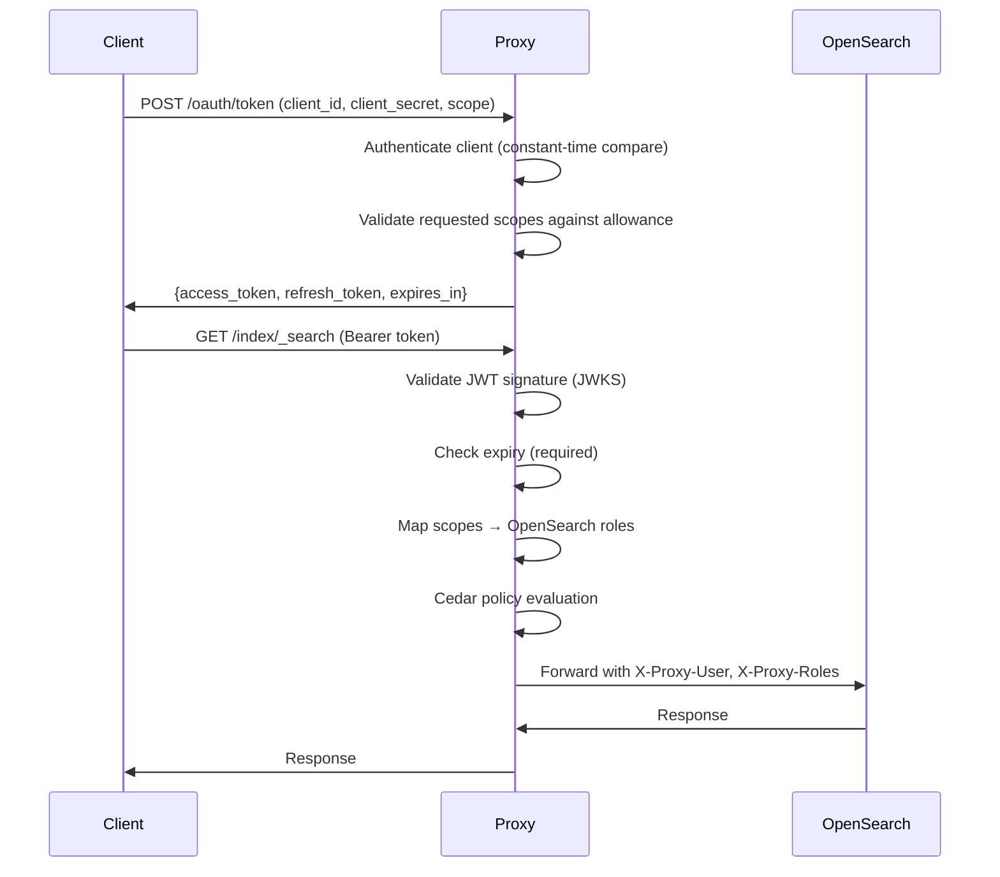
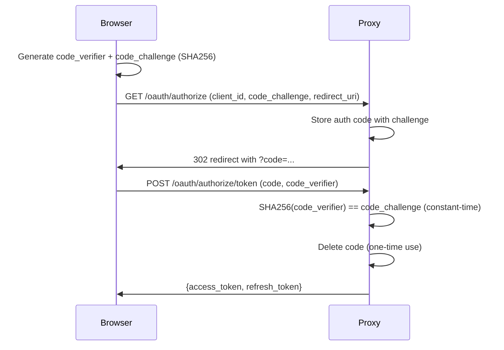
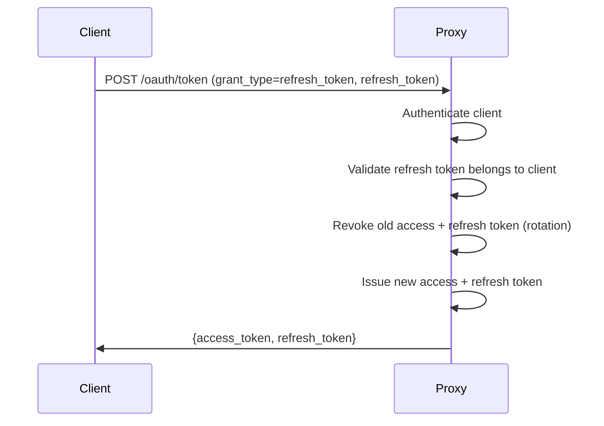

# Security Model — oauth4os

## Threat Model

### Assets
- **OpenSearch data** — indices containing logs, metrics, traces
- **OAuth tokens** — access tokens and refresh tokens
- **OIDC provider credentials** — client secrets, JWKS keys
- **Cedar policies** — access control rules
- **Proxy configuration** — upstream URLs, scope mappings

### Threat Actors
| Actor | Capability | Goal |
|---|---|---|
| External attacker | Network access to proxy | Unauthorized data access |
| Compromised client | Valid but limited token | Privilege escalation |
| Malicious IdP | Controls OIDC discovery | Token forgery, SSRF |
| Insider | Valid admin token | Access beyond scope |

### Attack Surface

```
Internet → [Proxy :8443] → [OpenSearch :9200]
              ↕                  ↕
         [OIDC Provider]    [Dashboards :5601]
```

## Authentication Flows

### Client Credentials (Machine-to-Machine)



### PKCE (Browser Clients)



### Token Refresh



## JWT Validation Steps

Every request with a Bearer token goes through this pipeline:

1. **Parse** — extract header and claims without verification
2. **Issuer lookup** — match `iss` claim to configured provider; reject unknown issuers
3. **JWKS fetch** — retrieve signing keys via OIDC auto-discovery or configured URI
   - 1-hour cache with forced refresh on key miss (handles rotation)
   - 10-second HTTP timeout on JWKS/discovery endpoints
4. **Key match** — find RSA key by `kid`; fallback to first RSA key if `kid` absent
5. **Signature verify** — RSA signature validation; reject non-RSA algorithms (prevents alg confusion)
6. **Expiry check** — `exp` claim required and validated (no grace period)
7. **Scope extraction** — supports space-delimited string and JSON array formats
8. **Client ID extraction** — from `client_id` or `azp` claim

### OIDC Auto-Discovery Security

- Discovery URL derived from issuer: `{issuer}/.well-known/openid-configuration`
- **Issuer mismatch check**: discovery document's `issuer` field must match configured issuer (prevents SSRF via redirect)
- Resolved JWKS URI cached after first discovery

## Cedar Policy Evaluation

Cedar policies are evaluated after JWT validation and scope mapping:

```
Request → JWT Validation → Scope Mapping → Cedar Evaluation → Proxy Forward
```

### Evaluation Model

- **Forbid-overrides**: any matching `forbid` policy denies the request, regardless of `permit` policies
- **Default deny**: if no `permit` policy matches, the request is denied
- **Matching**: principal (JWT sub), action (HTTP method), resource (OpenSearch index)
- **Conditions**: `when` (must be true) and `unless` (must be false) clauses

### Example Policies

```cedar
// Allow read access to logs indices for clients with read:logs scope
permit(*, GET, logs-*)
  when { principal.scope contains "read:logs" };

// Block all access to security index (except admins)
forbid(*, *, .opendistro_security)
  unless { principal.role == "admin" };

// Deny write operations for read-only clients
forbid(*, PUT, *)
  when { principal.scope contains "read:" };
forbid(*, POST, *)
  when { principal.scope contains "read:" };
forbid(*, DELETE, *)
  when { principal.scope contains "read:" };
```

### Supported Condition Operators

| Operator | Example | Description |
|---|---|---|
| `==` | `principal.sub == "admin"` | Exact match |
| `!=` | `resource.index != ".kibana"` | Not equal |
| `contains` | `principal.scope contains "read:logs"` | Substring match |
| `in` | `principal.role in "admin,superuser"` | Value in comma-separated list |

## Token Introspection (RFC 7662)

`POST /oauth/introspect` returns token metadata:

```json
{
  "active": true,
  "scope": "read:logs-* write:dashboards",
  "client_id": "my-agent",
  "sub": "my-agent",
  "exp": 1712890800,
  "iat": 1712887200,
  "token_type": "Bearer"
}
```

- Revoked or expired tokens return `{"active": false}`
- No token details leaked for inactive tokens

## Security Controls Summary

| Control | Implementation |
|---|---|
| Client authentication | Constant-time secret comparison (`crypto/subtle`) |
| Client persistence | Atomic writes + `.bak` backup + corruption recovery |
| Token expiry | Required `exp` claim, validated on every request |
| Sliding window refresh | Active tokens extend expiry; refresh rotates + family revocation |
| Scope enforcement | 3-layer: issuance validation → role mapping → Cedar policy |
| PKCE verification | S256 only, constant-time compare, one-time codes, 10-min expiry |
| Refresh token rotation | Old token revoked on refresh (prevents replay) |
| JWKS key rotation | Auto-retry on cache miss |
| SSRF prevention | Issuer mismatch check in OIDC discovery |
| Algorithm confusion | Only RSA signing methods accepted |
| Error information leakage | Generic error messages, no internal details exposed |
| Request tracing | X-Request-ID on every proxied request |
| Audit logging | All authenticated requests logged with client, scopes, method, path |
| IP filtering | Per-client allowlist/denylist with CIDR matching |
| mTLS | Optional mutual TLS for client certificate authentication |
| Rate limiting | Token bucket per client with configurable burst |

## Client Persistence Security

Registered clients are persisted to `data/clients.json` with the following safeguards:

### Atomic Writes
Client data is never written directly to the target file. Instead:
1. Data is serialized to a temporary file (`clients.json.tmp.<nanos>`)
2. The temp file is atomically renamed to `clients.json` via `os.Rename`

This prevents partial writes from corrupting the store if the process crashes mid-save.

### Automatic Backup
Before every save, the existing `clients.json` is renamed to `clients.json.bak`. If the primary file becomes corrupt, the store automatically falls back to the backup on next startup.

### Corruption Recovery
On startup, `NewClientStore` attempts to load `clients.json`. If JSON parsing fails:
1. Loads `clients.json.bak` instead
2. If both are corrupt, starts with an empty client set (no crash)

### File Permissions
Client data is written with `0644` permissions. The `data/` directory is created with `0755`. Client secrets are stored in plaintext — production deployments should encrypt at rest or use a secrets manager.

### Concurrency
A `sync.Mutex` serializes all writes. The in-memory `Manager` uses `sync.RWMutex` for concurrent read access. Multiple proxy instances sharing the same file are not supported — use a database backend for HA deployments.

## Sliding Window Token Refresh

Tokens support sliding window expiry extension on active use:

- When a client uses a valid access token, the proxy can extend its expiry
- Refresh tokens rotate on every use — the old refresh token is immediately revoked
- **Reuse detection**: if a revoked refresh token is presented, the entire token family is revoked (prevents stolen token replay)
- Token families track all tokens issued from the same initial grant, enabling cascade revocation

### Token Lifecycle

```
Issue → [active use extends expiry] → Refresh → [old token revoked] → New token
                                                                        ↓
                                                              [old refresh reused?]
                                                                        ↓
                                                              Revoke entire family
```

## Scope Enforcement

Scope enforcement operates at three layers:

### Layer 1: Token Issuance
- Clients are registered with allowed scopes (e.g., `["read:logs"]`)
- Token requests can only include scopes the client is authorized for
- Requesting unauthorized scopes returns `400 invalid_scope`

### Layer 2: Scope-to-Role Mapping
- Scopes are mapped to OpenSearch roles via `scope_mapping` config
- Example: `read:logs` → `logs_reader` role, `write:logs` → `logs_writer` role
- Multi-tenant mapping: different tenants can have different scope→role mappings

### Layer 3: Cedar Policy Evaluation
- Cedar policies enforce fine-grained access based on principal, action, and resource
- `forbid` policies override `permit` (deny-wins model)
- Conditions can inspect scopes: `when { principal.scope contains "read:logs" }`
- Resource patterns support glob matching: `logs-*` matches `logs-2025-04`

### Scope Enforcement Demo
The demo app at `/demo/app` demonstrates scope enforcement:
- Login grants `read:logs` scope → search queries succeed (200)
- Write operations (PUT, POST, DELETE) are blocked by Cedar policy → returns 403
- The CLI (`oauth4os-demo`) shows the same behavior

## v0.5.0 Security Features

| Feature | Security Benefit |
|---|---|
| API key auth (X-API-Key) | M2M auth with constant-time compare, per-key rate limits |
| Token binding | Binds tokens to client fingerprint (IP+UA), prevents stolen token reuse |
| RFC 7009 revocation | Standard token revocation, always returns 200 (prevents scanning) |
| DPoP prep (RFC 9449) | JWK thumbprint validation, method+freshness checks |
| PAR (RFC 9126) | Pushed auth requests prevent parameter tampering, one-time use |
| CIBA | Backchannel auth for headless services, 5-min expiry |
| Device flow (RFC 8628) | CLI/IoT auth without browser on device, 10-min code expiry |
| Introspection caching | 30s TTL cache reduces token store load under high traffic |
| client_secret_basic | HTTP Basic auth on token/refresh/revoke endpoints |
| Sliding window tokens | Auto-extend on active use, idle tokens expire normally |
| Webhook auth | External auth decisions, fail-closed by default |
| mTLS | Client cert auth as alternative to Bearer tokens |

## Known Limitations

1. **In-memory token store** — tokens (not clients) are lost on restart. Client registrations persist to `data/clients.json`. Production deployments should use Redis or DynamoDB for tokens.
2. **Single signing algorithm** — only RSA (RS256) supported. ES256/EdDSA not yet implemented.
3. **No token size limit** — extremely large JWTs are not rejected before parsing.
4. **PKCE codes in memory** — authorization codes not persisted; lost on restart.
5. **No rate limiting on auth endpoints** — `/oauth/token` and `/oauth/introspect` should have rate limits.
6. **Cedar policies static** — loaded at startup, no hot-reload without restart.
7. **Client secrets in plaintext** — `data/clients.json` stores secrets unencrypted. Use disk encryption or a secrets manager in production.
8. **Single-instance file persistence** — `data/clients.json` does not support concurrent access from multiple proxy instances.
